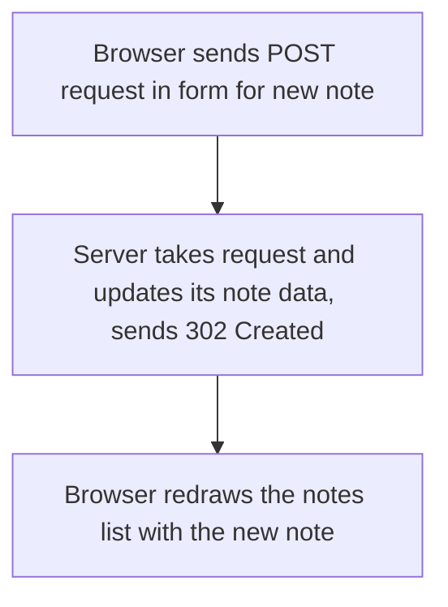

```mermaid
    graph TD;
        A[Browser sends POST request in form for new note]-->B[Server takes request and updates its note data, sends 302 Created];
        B-->C[Browser redraws the notes list with the new note];
```